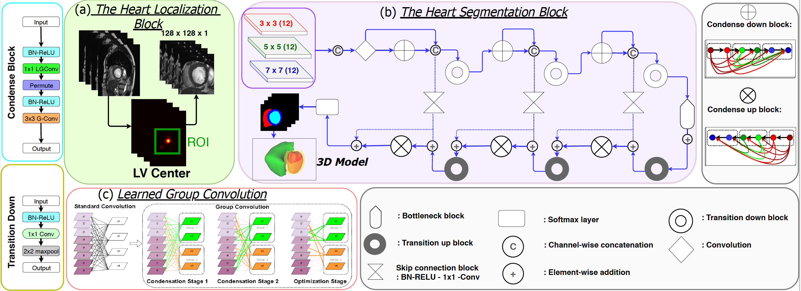

# L-CO-Net (Learned-Condensation-Optimizaton Network)

Condensely connected architecture for Cardiac Cine MR Image Segmentation and Quantification

This repository contains code to train state-of-the-art cardiac segmentation networks as described in this paper: CondenseUNet: A Memory-Efficient Condensely-Connected Architecture for Bi-ventricular Blood Pool and Myocardium
Segmentation. This architecture is trained on [MICCAI 2017 ACDC Cardiac segmentation challenge.](https://www.creatis.insa-lyon.fr/Challenge/acdc/index.html)

In this work, we implement a fully convolutional segmenter featuring both a learned group structure and a regularized weight pruner to reduce the high computational cost in volumetric image segmentation. We validated our framework on the ACDC dataset featuring one healthy and four pathology groups imaged throughout the cardiac cycle. Our technique achieved Dice scores of 96.80% (LV blood-pool), 93.33% (RV blood-pool) and 90.0% (LV Myocardium) with five-fold cross-validation and yielded similar clinical parameters as those estimated from the groundtruth segmentation data. Based on these results, this technique has the potential to become an efficient and competitive cardiac image segmentation tool that may be used for cardiac computer-aided diagnosis, planning and guidance applications.


# Prerequisites
Our code is compatible with python 3.7 or onward.

We depend on some python packages which need to be installed by the user:

* Tensorflow
* tqdm
* SimpleITK
* sklearn
* numpy
* nibabel
* h5py

# Authors 
* S. M. Kamrul Hasan ([sh3190@rit.edu])()
* Cristian A. Linte

# Contents 

* [Data]()
* [Method]()
* [Results]()
* [How to Run]()


# [Data]()

For this study, we used the ACDC dataset, which is composed of short-axis cardiac cine-MR images acquired from 100 different patients divided into 5 evenly distributed subgroups according to their cardiac condition: normal- NOR, myocardial infarction- MINF, dilated cardiomyopathy- DCM, hypertrophic cardiomyopathyHCM, and abnormal right ventricle- ARV, available as a part of the STACOM 2017 ACDC challenge.

### **Method: L-CO-Net**

We evaluate CondenseUNet architectures for segmentation as well as clinical parameter estimation. The output of the model is a pixel-by-pixel mask that shows the class of each pixel. Our proposed L-CO-Net framework substitutes the concept of both standard convolution and group convolution (G-Conv) with learned group-convolution (LGConv). While the standard convolution needs an increased level of computation, i.e. O(Ii x Oo), and concurrently, the pre-defined use of filters in each group convolution restricts its representation capability, these aforementioned problems are mitigated by introducing LG-Conv that learns group convolution dynamically during training through a multi-stage scheme.



Illustration of L-CO-Net framework: (a) ROI detection around LV-RV; (b)
Segmentation block consisting of a decoder and an encoder where each
condense block (CB) consists of 3 Layers with a growth rate of k = 16.
The transformations within each CB and the transition-down block are
labeled with a cyan and yellow box, respectively.

### **Qualitative Results**


Representative ED and ES frames segmentation results of a complete
cardiac cycle from the base (high slice index) to apex (low slice index)
showing RV blood-pool, LV blood-pool, and LV-Myocardium in purple, red,
and cyan respectively


Figure shows segmentation results and the ground truth masks for both 2D and 3D cases. It summarizes the comparison results, which show that our proposed model significantly improved the segmentation performance against several state-of-the-art multi-class segmentation techniques in terms of Dice metrics, Hausdorff distance, and clinical parameters. Our proposed L-CO-Net architecture achieved Dice score (Hausdorff distance) of 96.8%(7.9mm) and 95.1%(6.4mm) for the LV bloodpool, 89.5%(8.9mm) and 90.0%(8.9mm) for the LVMyocardium and 93.3%(11.2mm) and 87.43%(11.9mm) for the RV blood-pool in end-diastole and end-systole, respectively.


# [Table]()

Quantitative evaluation of the segmentation results in terms of Mean Dice score (%) with Hausdorff distance(in mm),
no. of parameters (×106 ), and the clinical indices evaluated on the ACDC dataset for LV, RV blood-pool and LV-myocardium compared across several best performing networks, including L-CONet. The statistical significance of the results for L-CO-Net model compared against five other base architectures.


**L-CO-Net: Learned Condensation-Optimization Network for Clinical Parameter Estimation from Cardiac Cine MRI** EMBC 2020, Oral 
---------------------------------------------------------------------------------------------------------------------------------

-   [S. M. Kamrul Hasan](http://ai.stanford.edu/~optas/) Rochester
    Institute of Technology
-   [Cristian A. Linte](http://aabdelreheem.me) Rochester Institute of
    Technology

-   [](https://arxiv.org/abs/2004.11253)

    #### **[ Paper ]**

-   [](#video)

    #### **[ Video ]**

-   [](https://github.com/lconet)

    #### **[ Code ]**

-   [](#dataset)

    #### **[ Dataset ]**

### **Abstract**

In this work, we implement a fully convolutional segmenter featuring
both a learned group structure and a regularized weight-pruner to reduce
the high computational cost in volumetric image segmentation. We
validated our framework on the ACDC dataset featuring one healthy and
four pathology groups imaged throughout the cardiac cycle. Our technique
achieved Dice scores of 96.8% (LV blood-pool), 93.3% (RV blood-pool) and
90.0% (LV Myocardium) with five-fold cross-validation and yielded
similar clinical parameters as those estimated from the ground truth
segmentation data. Based on these results, this technique has the
potential to become an efficient and competitive cardiac image
segmentation tool that may be used for cardiac computer-aided diagnosis,
planning, and guidance applications.

### **Video**

--\> --\>


### **Citation**

If you find our work useful in your research, please consider citing:

``` {.w3-panel .w3-leftbar .w3-light-grey}
@inproceedings{hasan2020co,
  title={L-CO-Net: Learned Condensation-Optimization Network for Segmentation and Clinical Parameter Estimation from Cardiac Cine MRI},
  author={Hasan, SM Kamrul and Linte, Cristian A},
  booktitle={2020 42nd Annual International Conference of the IEEE Engineering in Medicine \& Biology Society (EMBC)},
  pages={1217--1220},
  year={2020},
  organization={IEEE}
}
```

### **L-CO-Net participated post MICCAI STACOM-2017 ACDC Challenge**

Coming soon!

### **Acknowledgements**

Research reported in this publication was supported by the National
Institute of General Medical Sciences of the National Institutes of
Health under Award No. R35GM128877 and by the Office of Advanced Cyber
infrastructure of the National Science Foundation under Award No.
1808530. .


